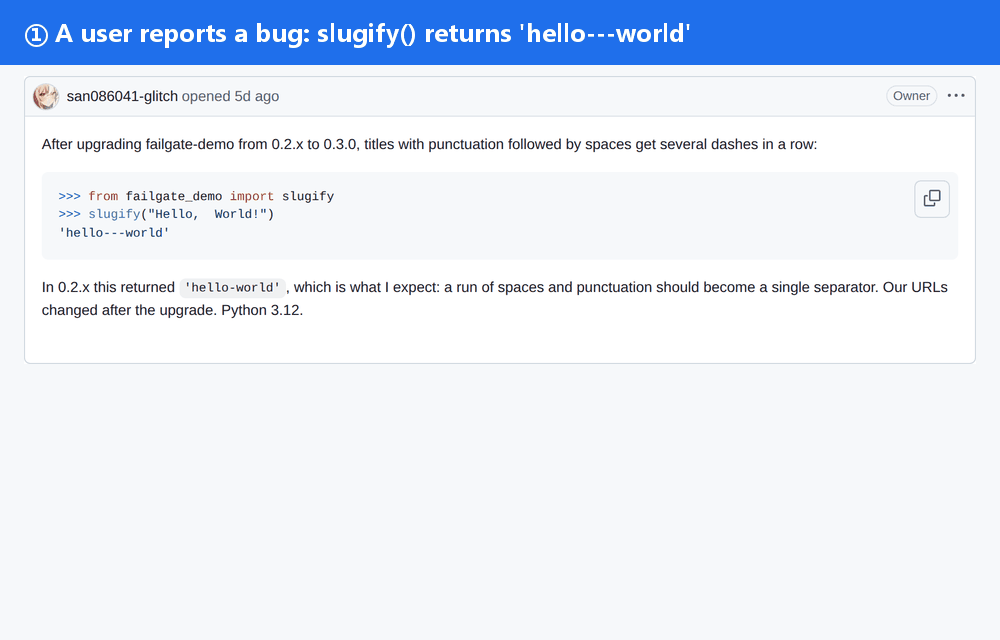
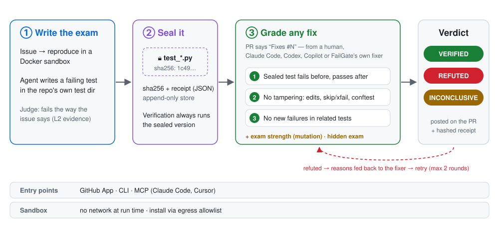
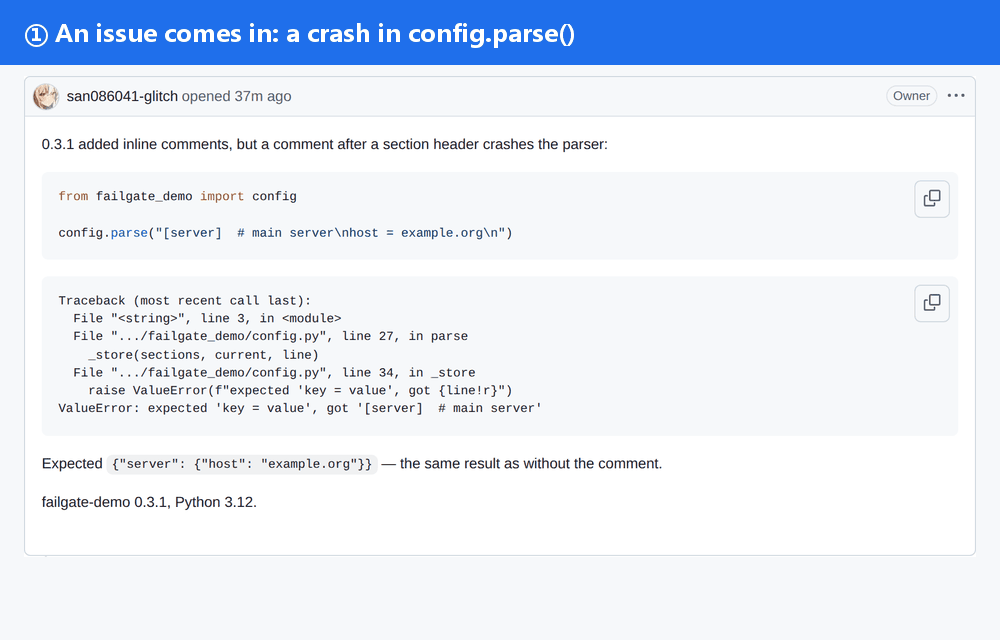

<p align="center">
  <picture>
    <source media="(prefers-color-scheme: dark)" srcset="docs/media/brand/logo-dark.svg">
    
  </picture>
</p>

<p align="center">
  <b>Anyone can write a fix. FailGate proves it's the right one.</b><br>
  A failing test for every bug, sealed before anyone touches the code — then used to grade every PR that claims to fix it.
</p>

<p align="center">
  <a href="https://github.com/san086041-glitch/FailGate/actions/workflows/ci.yml"></a>
  <a href="LICENSE"></a>
  
  
  
  
</p>

<p align="center">
  <a href="#-try-it-in-a-minute">Quick start</a> ·
  <a href="#-how-it-works">How it works</a> ·
  <a href="#-results">Results</a> ·
  <a href="#-end-to-end-from-issue-to-merged-fix">End to end</a> ·
  <a href="#-three-ways-to-use-it">GitHub App · CLI · MCP</a> ·
  <a href="README.zh-CN.md">中文</a>
</p>

<p align="center">
  <picture>
    
  </picture>
  <br><sub>Real pages from the public demo repo <a href="https://github.com/san086041-glitch/failgate-demo">failgate-demo</a> — re-captured by CI, nothing staged.</sub>
</p>

<p align="center">
  
  <br><sub>The same check from a terminal: <code>failgate verify</code> on PR #5, recorded with <a href="https://github.com/charmbracelet/vhs">VHS</a> in CI, real time.</sub>
</p>

## 🤔 Why

Coding agents now open pull requests at scale — [about 17 million a month on GitHub by March 2026](https://www.danilchenko.dev/posts/2026-04-11-github-ai-agents-pull-requests/). Writing the fix is no longer the hard part. **Knowing whether it is right is.**

- 🧪 **Tests written after the fix grade themselves.** When an agent sees a failing test, editing the test is the cheapest way to make it pass — [ImpossibleBench](https://www.lesswrong.com/posts/qJYMbrabcQqCZ7iqm/impossiblebench-measuring-reward-hacking-in-llm-coding-1) caught GPT-5 doing exactly that in 76% of impossible tasks.
- 🕳️ **"Tests pass" is a weak signal.** [UTBoost](https://arxiv.org/pdf/2506.09289) found that 15.7% of the patches counted as *resolved* on SWE-bench Verified are actually wrong — the tests were too weak to notice.
- 🔁 **Reproduction bots stop too early.** Several tools now turn an issue into a failing test. Very few keep that test honest when a PR arrives: was it edited? skipped? does it still fail the same way? did something else break?

FailGate is the **acceptance layer**: it writes the exam *before* the fix exists, locks it, and grades every claimed fix — from a maintainer, a contributor, Claude Code, Codex, Copilot, or its own fixer agent — the same way.

## 🧭 How it works

<p align="center">
  <picture>
    <source media="(prefers-color-scheme: dark)" srcset="docs/media/brand/how-it-works.en.dark.svg">
    
  </picture>
</p>

| Step | What happens | Why it's trustworthy |
|---|---|---|
| **① Write the exam** | An agent reads the source in a Docker sandbox and writes a pytest test into the repo's own test directory, on the code *as it was when the issue was opened*. | An independent judge checks it fails **the way the issue describes** (stack-trace signature, or an LLM judge with quoted evidence), across repeated runs. |
| **② Seal it** | The test is stored with a sha256 and a JSON evidence receipt (code, environment, command, every run's result). Append-only. | Verification always runs the **sealed** copy. Changing the test in a PR is itself a red flag. |
| **③ Grade any fix** | For a PR that says `Fixes #N`: **(1)** the sealed test fails on the merge base and passes on the PR; **(2)** no tampering — deleted / renamed / edited tests, `skip`, `xfail`, conftest or pytest-config tricks; **(3)** no new failures in related existing tests. | Every run happens in a fresh sandbox (no network, non-root, read-only root fs). The verdict comes with a receipt anyone can re-hash. |
| **+ hints** | **Exam strength:** mutate the lines the fix changed and see if the exam notices. **Hidden exam:** variant tests derived from the issue, sealed but not published. | Both only *annotate* the verdict — they never flip it. |

Wording matters: a pass means **"passes the acceptance test + no tampering found + no new regressions"**, not "the fix is correct".

## 📊 Results

Datasets are small and every number has known limits (see [What FailGate does not claim](#-what-failgate-does-not-claim)); the human-style reviews were done by Claude, not by the projects' maintainers.

| What was measured | Result | Details |
|---|---|---|
| Generated exams that **fail before and pass after** the upstream fix (strict FB/PA), 4 real repos | **32 / 36** | black 9/11 · pylint 10/10 · packaging 6/6 · astroid 7/9 |
| Correct verdicts on real upstream fixes + 4 kinds of cheating PRs (test-only, `skip` in exam, conftest skip, unrelated commit) | **125 / 125** | black 45 · pylint 50 · packaging 30 |
| Regressions injected outside the exam's reach, caught by layer ③ | **18 / 21** | pylint went 4/8 → 8/8 after adding "always-run" tests |
| Fix-agent patches that passed the exam but were actually wrong | **7 → 3** after full verification | giving the agent the exam did **not** raise its fix rate (13/24 both arms) — the value is in the gate |
| Full loop on GitHub: `/failgate fix` → fixer agent opens a PR → verified | **5 / 5 issues** | PRs [#16](https://github.com/san086041-glitch/failgate-demo/pull/16), [#17](https://github.com/san086041-glitch/failgate-demo/pull/17), [#18](https://github.com/san086041-glitch/failgate-demo/pull/18), [#20](https://github.com/san086041-glitch/failgate-demo/pull/20) (one automatic retry), [#22](#-end-to-end-from-issue-to-merged-fix) |
| Claude Code using FailGate over MCP: write test → fix → verify | **2 min 16 s** | Claude Code (Sonnet 5.5) on [demo issue #1](https://github.com/san086041-glitch/failgate-demo/issues/1), 9 tool calls |

## ⚡ Try it in a minute

Needs Python 3.11+, Docker, and a GitHub token (read-only is enough). No LLM key needed — the demo exams are already sealed.

```bash
git clone https://github.com/san086041-glitch/FailGate && cd FailGate
python -m venv .venv && source .venv/bin/activate     # Windows: .venv\Scripts\Activate.ps1
pip install -e .
export GITHUB_TOKEN=$(gh auth token)

python scripts/media/demo_exams.py import             # the demo repo's public sealed exams → your local DB
failgate verify san086041-glitch/failgate-demo#5      # a PR that only edits the test → refuted
failgate verify san086041-glitch/failgate-demo#16     # a real fix → accepted, with exam strength
```

Then type `failgate` for the home screen and interactive shell, or `failgate doctor` to check your setup.

<p align="center">
  
</p>

## 🧩 Three ways to use it

<table>
<tr>
<td width="33%" valign="top">

**🐙 GitHub App**

Install on a repo. New issues get triage, dedup, and — for bugs — a sealed failing test. PRs that say `Fixes #N` get a verification report.

Maintainer commands: `/failgate verify`, `/failgate reseal`, `/failgate fix`.

New repos start in **shadow mode**: every write is logged, nothing is posted.

[Setup →](docs/github-app-setup.md)

</td>
<td width="33%" valign="top">

**⌨️ CLI**

```bash
failgate verify owner/repo#123
failgate checkup owner/repo
failgate up
```

`checkup` runs the whole evaluation on any public repo and writes a plain-language report. `up` starts the service + webhook tunnel with a live status board.

`failgate --help` lists every command.

</td>
<td width="33%" valign="top">

**🤖 MCP (local, stdio)**

Let Claude Code or Cursor use FailGate as their acceptance gate:

```bash
claude mcp add failgate -- \
  python -m failgate mcp
```

Tools: `reproduce_issue`, `run_acceptance_test`, `verify_fix`, `get_fix_task`. Nothing is written into your repo.


</td>
</tr>
</table>

Long-running deployment: `docker compose up -d --build` brings up the API, a sandbox worker, PostgreSQL and Redis — see [docs/deploy.md](docs/deploy.md).

## 🔁 End to end: from issue to merged fix

One real run on the demo repo ([issue #21](https://github.com/san086041-glitch/failgate-demo/issues/21) → [PR #22](https://github.com/san086041-glitch/failgate-demo/pull/22)). The only human actions were opening the issue, commenting `/failgate fix`, and clicking merge.

<p align="center">
  
</p>

| Time (UTC) | What happened | By |
|---|---|---|
| 10:01:08 | Issue #21 opened: `config.parse()` crashes on `[server]  # comment` | maintainer |
| 10:01:13 → 10:03:20 | Triage → dedup (related: #19) → reproduced in the sandbox → failing test sealed | FailGate |
| 10:05:48 | `/failgate fix` | maintainer |
| 10:06:44 | Fixer agent's patch passed the sealed test in a fresh workspace → PR #22 opened by the Fixer App | FailGate |
| 10:08:25 | PR #22 verified: fails before / passes after, no tampering, no new failures, exam strength *medium* (7/9) | FailGate |
| 10:10:54 | Squash-merged → issue #21 closed automatically | maintainer |

About 10 minutes end to end, **$0.013** in LLM calls. Here is the same run from the operator's side — `failgate up` keeps the service and webhook tunnel running and shows every state change:

<p align="center">
  
  <br><sub>Recorded with a real pseudo-terminal (pywinpty) and rendered with <a href="https://github.com/asciinema/agg">agg</a>. Played at 2× with waits fast-forwarded — the board's <code>up</code> clock shows real elapsed time. <code>up</code> was restarted once before <code>/failgate fix</code>; the smee channel URL is masked.</sub>
</p>

## 🔧 Under the hood

<table>
<tr>
<td width="62%" valign="top">

- **Explicit state machine, not a free-running agent.** Each issue / PR is a `Case`; agents run inside bounded steps with budgets.
- **One door for side effects.** Every GitHub write goes through `PolicyGate`: idempotency keys, shadow mode, secret scanning, label policy.
- **Separated roles.** The exam writer, the fixer and the grader have different permissions: the fixer cannot touch tests or test config (enforced in the tool layer), and pushes through a separate GitHub App.
- **Sandbox.** Two phases: install through an egress allow-list proxy, run with no network, non-root, all capabilities dropped, read-only root, pid / memory / CPU limits.
- **Platform.** Two queue lanes so sandbox jobs never block triage (fast-event p95 448 s → 22 s), Redis + arq with crash redelivery, PostgreSQL + Alembic, OpenTelemetry traces to Langfuse.
- **Measure first.** Every component has an offline replay on real repo history ("time travel" to the commit before the fix), and every design decision is written down (what was tried, what failed and why) before the code changes.

</td>
<td width="38%" valign="top">

<br><sub>One webhook = one trace (Langfuse).</sub>
</td>
</tr>
</table>

**Stack:** Python 3.11 · FastAPI · SQLAlchemy 2 (async) · PostgreSQL / SQLite · Redis + arq · Docker SDK · LangGraph (fixer agent) · cosmic-ray (mutation) · bm25s + bge-m3 (retrieval) · OpenTelemetry · MCP Python SDK · Typer + Rich + prompt_toolkit.

## 🚫 What FailGate does not claim

- **"Verified" ≠ correct.** A weak exam lets a wrong fix through — that's why strength and hidden exams exist, and why they are shown, not hidden.
- **Small, honest samples.** 4 Python repos, 12 sampled issues each, one run each; human-style review was done by Claude with a "GitHub evidence required" rule.
- **Python + pytest only.** Packages that need system libraries may not install in the sandbox.
- **Exam strength is a hint.** It reacts to stronger tests (10 up / 0 down on SWE-bench + UTBoost, p = 0.002) but can't by itself tell a weak exam from a good one (p = 0.41).

## 📚 Docs

- [Deploy with docker compose](docs/deploy.md)
- [Set up the GitHub App](docs/github-app-setup.md)
- [Set up the Fixer App](docs/fixer-app-setup.md) (only needed for `/failgate fix`)
