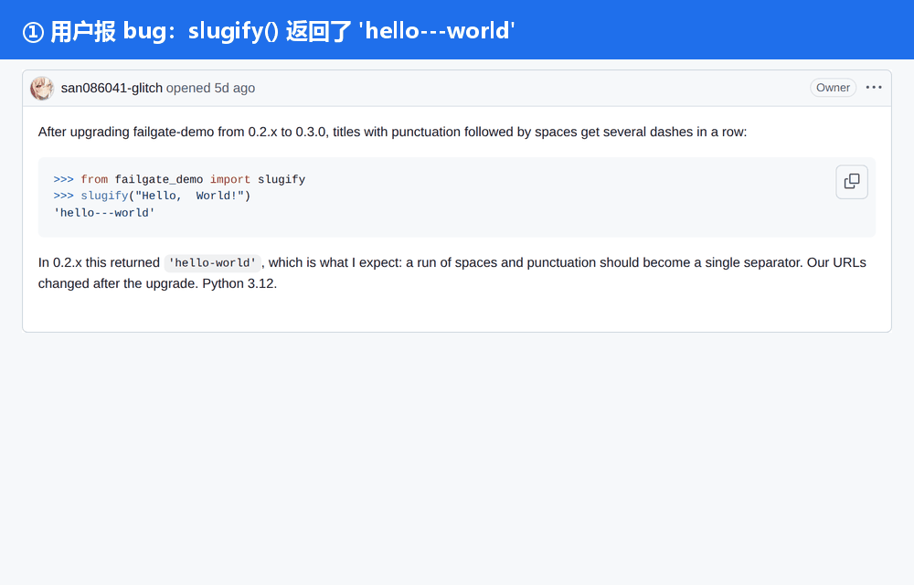
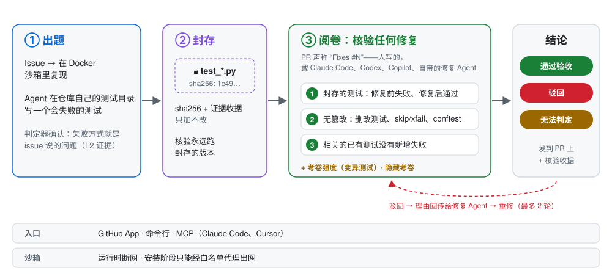
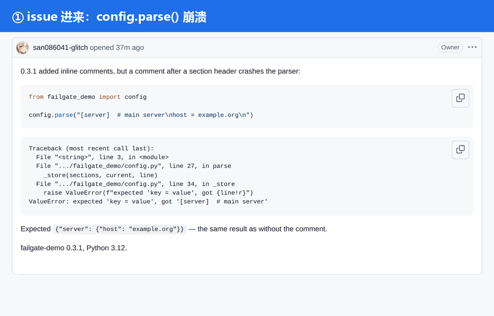
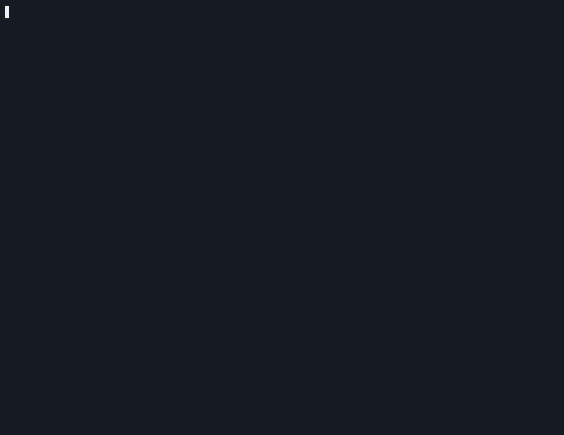
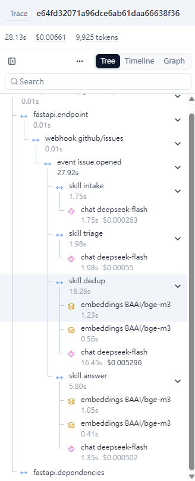

<p align="center">
  <picture>
    <source media="(prefers-color-scheme: dark)" srcset="docs/media/brand/logo-dark.svg">
    
  </picture>
</p>

<p align="center">
  <b>修复谁都能写，FailGate 负责证明它修对了。</b><br>
  在任何人动代码之前，先给 bug 写一个会失败的测试并封存；之后用它核验每一个声称修好这个 bug 的 PR。
</p>

<p align="center">
  <a href="https://github.com/san086041-glitch/FailGate/actions/workflows/ci.yml"></a>
  <a href="LICENSE"></a>
  
  
  
  
</p>

<p align="center">
  <a href="#-一分钟试用">快速开始</a> ·
  <a href="#-原理">原理</a> ·
  <a href="#-实测数据">实测数据</a> ·
  <a href="#-完整流程从-issue-进来到修复合并">完整流程</a> ·
  <a href="#-三种用法">GitHub App · 命令行 · MCP</a> ·
  <a href="README.md">English</a>
</p>

<p align="center">
  <picture>
    
  </picture>
  <br><sub>画面来自公开演示仓库 <a href="https://github.com/san086041-glitch/failgate-demo">failgate-demo</a> 的真实页面，由 CI 重新截取，没有摆拍。</sub>
</p>

<p align="center">
  
  <br><sub>同一次核验也能在终端里跑：对 PR #5 运行 <code>failgate verify</code>，CI 里用 <a href="https://github.com/charmbracelet/vhs">VHS</a> 按真实速度录制。</sub>
</p>

## 🤔 为什么需要它

编程 Agent 已经在大规模提 PR：[2026 年 3 月 GitHub 上每月约 1700 万个](https://www.danilchenko.dev/posts/2026-04-11-github-ai-agents-pull-requests/)。写出修复已经不难，**难的是判断它对不对**。

- 🧪 **修复之后才写的测试，等于自己给自己打分。** Agent 面对失败的测试时，改测试是最省事的通过办法。[ImpossibleBench](https://www.lesswrong.com/posts/qJYMbrabcQqCZ7iqm/impossiblebench-measuring-reward-hacking-in-llm-coding-1) 发现 GPT-5 在 76% 的"不可能任务"里就是这么做的。
- 🕳️ **"测试通过"本身是很弱的信号。** [UTBoost](https://arxiv.org/pdf/2506.09289) 发现，SWE-bench Verified 里被算作"已解决"的补丁，有 15.7% 其实是错的，只是测试太弱没发现。
- 🔁 **复现机器人停得太早。** 已经有不少工具能把 issue 变成一个失败的测试，但 PR 来了以后，很少有人继续守住这份测试：它被改过吗？被跳过了吗？失败方式还是同一个吗？别的地方有没有被改坏？

FailGate 是 bug 的**验收层**：在修复出现之前出好考卷并封存，之后对每一个声称修好的 PR 用同一套标准阅卷。PR 不管来自维护者、贡献者，还是 Claude Code、Codex、Copilot 或 FailGate 自带的修复 Agent，都一样对待。

## 🧭 原理

<p align="center">
  <picture>
    <source media="(prefers-color-scheme: dark)" srcset="docs/media/brand/how-it-works.zh.dark.svg">
    
  </picture>
</p>

| 步骤 | 做什么 | 为什么可信 |
|---|---|---|
| **① 出题** | Agent 在 Docker 沙箱里读源码，在 **issue 创建时的代码**上，往仓库自己的测试目录里写一个 pytest 测试。 | 由独立的判定器确认它的失败方式**就是 issue 描述的那个问题**（比对堆栈签名；没有堆栈时由 LLM 评委引用原文判断），并且多次运行结果一致。 |
| **② 封存** | 测试连同 sha256 和一份 JSON 证据收据（代码、环境、命令、每次运行的结果）一起保存，只加不改。 | 核验永远跑**封存的那一份**。PR 里改了这个测试，本身就是危险信号。 |
| **③ 阅卷** | PR 写了 `Fixes #N` 时查三层：**(1)** 封存的测试在合并基点上失败、在 PR 上通过；**(2)** 无篡改：删改测试、`skip`、`xfail`、conftest 或 pytest 配置；**(3)** 相关的已有测试没有新增失败。 | 每次都在全新的沙箱里跑（断网、非 root、根目录只读）。结论附一份任何人都能重算哈希的收据。 |
| **+ 提示** | **考卷强度**：把修复改动过的代码悄悄改坏，看考卷能不能察觉。**隐藏考卷**：只根据 issue 出的变体题，封存但不公开。 | 两者都只**附在结论旁边**，不会改变结论。 |

措辞很重要：通过的意思是 **"通过验收测试 + 未发现篡改 + 无新增回归"**，不是"修复一定正确"。

## 📊 实测数据

样本都不大，每个数字都有已知的局限（见[FailGate 不声称什么](#-failgate-不声称什么)）；人工复核是 Claude 做的，不是各项目的维护者。

| 测了什么 | 结果 | 详情 |
|---|---|---|
| 生成的考卷在上游修复前失败、修复后通过（严格 FB/PA），4 个真实仓库 | **32 / 36** | black 9/11 · pylint 10/10 · packaging 6/6 · astroid 7/9 |
| 上游真实修复 + 4 种作弊 PR（只改测试、考卷里加 skip、conftest 跳过、无关提交）的结论全部判对 | **125 / 125** | black 45 · pylint 50 · packaging 30 |
| 在考卷管不到的地方注入回归，被第 ③ 层抓到 | **18 / 21** | pylint 加了"总要跑的测试"后从 4/8 升到 8/8 |
| LangChain monorepo（`libs/core`）留出集，在 GitHub Actions 上跑 | 出题 **6 / 6** · 严格 FB/PA **4 / 5** · 核验 **22 / 23** | 真实修复 4/4 · 作弊 16/16 · 注入回归 2/3（漏的那个：仓库已有测试都执行不到被注入的函数） |
| 修复 Agent 过了考卷、其实没修对的补丁 | 走完完整核验后 **7 → 3** | 给 Agent 看考卷**没有**提高修对率（两组都是 13/24），价值在验收门本身 |
| GitHub 上的完整闭环：`/failgate fix` → 修复 Agent 开 PR → 通过核验 | **5 / 5 个 issue** | PR [#16](https://github.com/san086041-glitch/failgate-demo/pull/16)、[#17](https://github.com/san086041-glitch/failgate-demo/pull/17)、[#18](https://github.com/san086041-glitch/failgate-demo/pull/18)、[#20](https://github.com/san086041-glitch/failgate-demo/pull/20)（自动重修一轮）、[#22](#-完整流程从-issue-进来到修复合并) |
| Claude Code 通过 MCP 使用 FailGate：写测试 → 修 → 核验 | **2 分 16 秒** | Claude Code（Sonnet 5.5）处理[演示 issue #1](https://github.com/san086041-glitch/failgate-demo/issues/1)，9 次工具调用 |

## ⚡ 一分钟试用

需要 Python 3.11+、Docker 和一个 GitHub 令牌（只读就够）。不需要 LLM 的 key：演示仓库的考卷已经封存好了。

```bash
git clone https://github.com/san086041-glitch/FailGate && cd FailGate
python -m venv .venv && source .venv/bin/activate     # Windows：.venv\Scripts\Activate.ps1
pip install -e .
export GITHUB_TOKEN=$(gh auth token)

python scripts/media/demo_exams.py import             # 把演示仓库公开的封存考卷导入本机数据库
failgate verify san086041-glitch/failgate-demo#5      # 只改了测试的 PR → 驳回
failgate verify san086041-glitch/failgate-demo#16     # 真正的修复 → 通过验收，并给出考卷强度
```

之后直接输入 `failgate` 进入首页和交互模式，或者运行 `failgate doctor` 检查环境。

<p align="center">
  
</p>

## 🧩 三种用法

<table>
<tr>
<td width="33%" valign="top">

**🐙 GitHub App**

装到仓库上以后：新 issue 会被分诊、查重；如果是 bug，还会得到一个封存的失败测试。写了 `Fixes #N` 的 PR 会收到核验报告。

维护者命令：`/failgate verify`、`/failgate reseal`、`/failgate fix`。

新接入的仓库默认是**影子模式**：所有写操作只记录，不发出去。

[安装步骤 →](docs/github-app-setup.md)

</td>
<td width="33%" valign="top">

**⌨️ 命令行**

```bash
failgate verify owner/repo#123
failgate checkup owner/repo
failgate up
```

`checkup` 对任意公开仓库跑一遍完整评测，生成大白话报告。`up` 一条命令起服务和 webhook 转发，底部有实时状态板。

`failgate --help` 列出全部命令。

</td>
<td width="33%" valign="top">

**🤖 MCP（本地 stdio）**

让 Claude Code、Cursor 把 FailGate 当验收门用：

```bash
claude mcp add failgate -- \
  python -m failgate mcp
```

工具：`reproduce_issue`、`run_acceptance_test`、`verify_fix`、`get_fix_task`。不会往你的仓库里写文件。


</td>
</tr>
</table>

长期部署：`docker compose up -d --build` 一起起来 API、沙箱 worker、PostgreSQL 和 Redis，见 [docs/deploy.md](docs/deploy.md)。

## 🔁 完整流程：从 issue 进来到修复合并

下面是在演示仓库上真实跑的一轮（[issue #21](https://github.com/san086041-glitch/failgate-demo/issues/21) → [PR #22](https://github.com/san086041-glitch/failgate-demo/pull/22)）。人只做了三件事：开 issue、评论 `/failgate fix`、点合并。

<p align="center">
  
</p>

| 时间（UTC） | 发生了什么 | 谁 |
|---|---|---|
| 10:01:08 | 开 issue #21：`config.parse()` 遇到 `[server]  # 注释` 会崩溃 | 维护者 |
| 10:01:13 → 10:03:20 | 分诊 → 查重（关联 #19）→ 在沙箱里复现 → 封存失败测试 | FailGate |
| 10:05:48 | 评论 `/failgate fix` | 维护者 |
| 10:06:44 | 修复 Agent 的补丁在全新工作区里通过封存的考卷 → Fixer App 开出 PR #22 | FailGate |
| 10:08:25 | PR #22 通过核验：修复前失败、修复后通过，无篡改，无新增失败，考卷强度"中"（7/9） | FailGate |
| 10:10:54 | squash 合并 → issue #21 自动关闭 | 维护者 |

全程约 10 分钟，LLM 花费 **$0.013**。同一轮在运维这一侧的样子：`failgate up` 一条命令挂着服务和 webhook 转发，每一次状态变化都显示在状态板上。

<p align="center">
  
  <br><sub>用真实的伪终端（pywinpty）录制、<a href="https://github.com/asciinema/agg">agg</a> 渲染，英文界面。2 倍速播放，等待部分做了快进；状态板上 <code>up</code> 的时钟是真实经过的时间。评论 <code>/failgate fix</code> 之前重启过一次 <code>up</code>；smee 通道地址已打码。</sub>
</p>

## 🔧 工程实现

<table>
<tr>
<td width="62%" valign="top">

- **显式状态机，而不是让 Agent 自由循环。** 每个 issue / PR 是一个 `Case`，Agent 只在有边界、有预算的步骤里运行。
- **对外写操作只有一个出口。** 所有 GitHub 写操作都经过 `PolicyGate`：幂等键、影子模式、密钥扫描、标签策略。
- **角色隔离。** 出题、修复、阅卷的权限各不相同：修复 Agent 在工具层就改不了测试和测试配置，推送用单独的 GitHub App。
- **沙箱。** 分两个阶段：安装阶段只能经白名单代理出网；运行阶段断网、非 root、去掉全部 capabilities、根目录只读、限制 pid / 内存 / CPU。
- **平台。** 两条队列车道，沙箱任务不再挡住分诊（快事件 p95 从 448 秒降到 22 秒）；Redis + arq，进程崩溃后任务会重投；PostgreSQL + Alembic；OpenTelemetry 链路发到 Langfuse。
- **先量后改。** 每个模块都有基于真实仓库历史的离线回放（"时间旅行"到修复前的那个提交）；每个设计决定在改代码前都先写下来：试过什么、哪里失败了、为什么这样选。

</td>
<td width="38%" valign="top">

<br><sub>一次 webhook 就是一条链路（Langfuse）。</sub>
</td>
</tr>
</table>

**技术栈：** Python 3.11 · FastAPI · SQLAlchemy 2（异步）· PostgreSQL / SQLite · Redis + arq · Docker SDK · LangGraph（修复 Agent）· cosmic-ray（变异测试）· bm25s + bge-m3（检索）· OpenTelemetry · MCP Python SDK · Typer + Rich + prompt_toolkit。

## 🚫 FailGate 不声称什么

- **"通过验收"不等于"修对了"。** 考卷太弱时，错误的修复也能通过。这正是考卷强度和隐藏考卷存在的原因，所以它们会显示出来，而不是藏起来。
- **样本小，但如实报告。** 4 个 Python 仓库，每个抽 12 个 issue，每个只跑一次；人工复核由 Claude 按"必须有 GitHub 证据"的规则完成。
- **目前只支持 Python + pytest。** 需要系统库的包可能在沙箱里装不上。monorepo 要求被测包在一个子目录里（`--subdir libs/core`，如 LangChain）。更多语言见[路线图](#️-路线图)。
- **考卷强度只是提示。** 测试被补强时强度分会跟着上升（SWE-bench + UTBoost 上 10 个上升、0 个下降，p = 0.002），但单看强度分，分不出考卷是太弱还是够用（p = 0.41）。

## 🗺️ 路线图

- **适配更多语言。** 目前支持 Python + pytest。出题 → 封存 → 阅卷这套设计本身不依赖语言，和 Python 绑定的只有四个适配器：沙箱里装环境、跑测试、解析失败签名、变异测试。下一步是 JavaScript / TypeScript（Jest、Vitest），之后是 Go 和 Java。
- **更多平台。** 在 GitHub 之外支持 Gitee。
- **v0.1 版本发布**，附完整的演示录屏。

## 📚 文档

- [用 docker compose 部署](docs/deploy.md)
- [配置 GitHub App](docs/github-app-setup.md)
- [配置 Fixer App](docs/fixer-app-setup.md)（只有用 `/failgate fix` 才需要）
